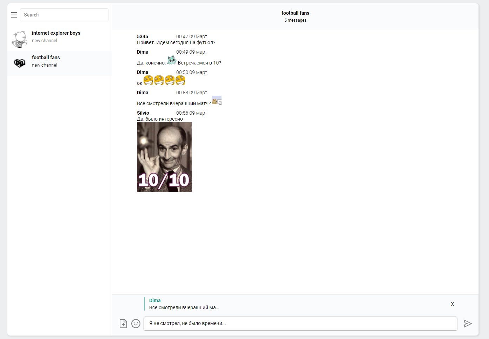

# anon-chat-react
Anonymous chat built with MERN stack
## Usage
Anonymous chat that doesn't require registration. 
Chat has an implementation of custom emojies and image uploads. 
## Stack
###### Backend:
* MongoDB
* NodeJS & Express
* Socket.io
###### Frontend:
* Typescript
* React 
* Redux
* React-router
* Axios

## Screenshot of user interface
